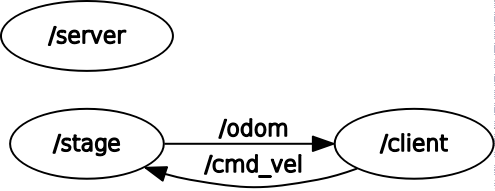
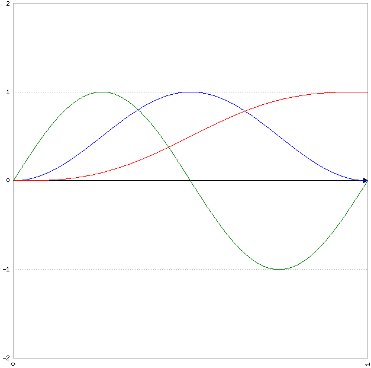

## Overview

This package was developed as a solution of the first assignment of the Research Track I course of Robotics Engineering held by Professor Recchiuto Carmine. The package allows a simulated robot to generate and reach random goals in a 2d space in ros stage.

### Licence

**Author: Leonardo Spinelli 
Affiliation: University of Genoa 
Maintainer: Leonardo Spinelli, leonardo.spinelli91@gmail.com**

The assignment1_solution package has been tested under ROS Melodic on Ubuntu 16.04.6 LTS.

### Building from source

To build from source, clone the latest version from this repository into your catkin workspace and compile the package using:

	cd catkin_workspace/src
	git clone https://github.com/LeonardoSpi/assignment1_solution
	cd ../
	catkin_make

## Usage

To run the solution you can use the solution.launch file:

	roslaunch assignment1_solution solution.launch

## Launch files

* **solution.launch** This launch file will starts 3 nodes: stage, server, client.

	- **'stage'** Spawn the robot in the ros stage environment.

	- **'server'** Start a service server node which will generate a random goal between (-6,6) when requested.

	- **'client'** Start service client that asks the server for a goal and then commands the robot to reach it. Respawn and output are set to True, so that the once a goal is reached the client will send another request and the output will be printed to screen.

## Custom Nodes

### Server

Waits for requests in order to generate random x and y coordinates in the interval (-6, 6)

#### Subscribed Topics

None

#### Published Topics

None

#### Services

* **`goal_generator`** ([assignment1_solution/goal])

	Returns a random goal in x and y coordinates in the interval (-6, 6). The service takes as a request a 		bool, if it is True it generates the random goal responding with two floats: x and y. If the request is 	False than the goal is set to x=0, y=0, the robot comes back to the starting position.

### Client

Asks to the server for a random goal. Moves the robot using a specific law of motion which is described in the graphs below.

-  Displacement function
-  Velocity function
-  Acceleration function

The function has been developed with the intent to have 0 initial and final velocities and accelerations for both axis.

#### Subscribed Topics

* **`/odom`** ([nav_msgs.msg/Odometry])

	The current position of the robot.

#### Published Topics

* **`/cmd_vel`** ([geometry_msgs.msg/Twist])

	The current robot velocities.

#### Services

* **`goal_generator`** ([assignment1_solution/goal])

	Request goal
 

